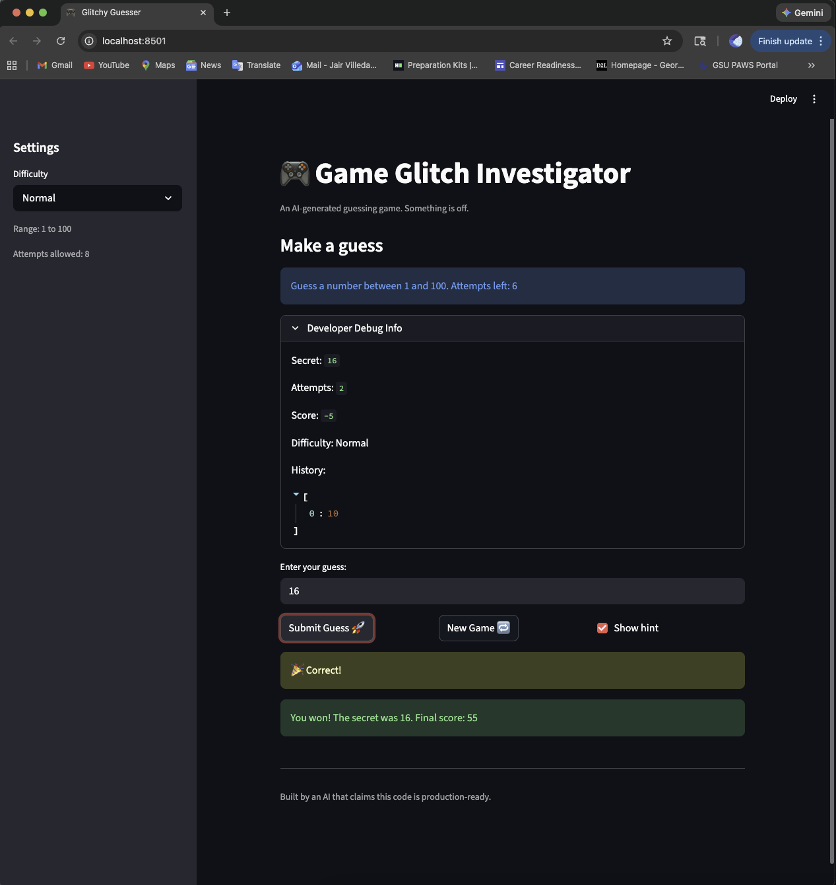

# 🎮 Game Glitch Investigator: The Impossible Guesser

## 🚨 The Situation

You asked an AI to build a simple "Number Guessing Game" using Streamlit.
It wrote the code, ran away, and now the game is unplayable. 

- You can't win.
- The hints lie to you.
- The secret number seems to have commitment issues.

## 🛠️ Setup

1. Install dependencies: `pip install -r requirements.txt`
2. Run the broken app: `python -m streamlit run app.py`

## 🕵️‍♂️ Your Mission

1. **Play the game.** Open the "Developer Debug Info" tab in the app to see the secret number. Try to win.
2. **Find the State Bug.** Why does the secret number change every time you click "Submit"? Ask ChatGPT: *"How do I keep a variable from resetting in Streamlit when I click a button?"*
3. **Fix the Logic.** The hints ("Higher/Lower") are wrong. Fix them.
4. **Refactor & Test.** - Move the logic into `logic_utils.py`.
   - Run `pytest` in your terminal.
   - Keep fixing until all tests pass!

## 📝 Document Your Experience

- [ ] Describe the game's purpose.
The game is a number guessing game where the player is supposed to guess a secret number. The game provides hints to help the player. The difficulty levels affect the range of numbers and the number of allowed attempts.
- [ ] Detail which bugs you found.
The hint messages were backwards. The game told the player to "Go Higher" when the guess was too high and vice versa.
The "New Game" button did not work properly. Clicking the button did not reset the game state so the player could not submit a guess for the new secret number.
The difficulty ranges were not being applied correctly. The secret number would fall outside the range specified by the difficulty level.
- [ ] Explain what fixes you applied.
I refactored the core game logic functions (check_guess, parse_guess, get_range_for_difficulty, update_score) into logic_utils.py.
I fixed the hint messages in check_guess() to match the actual comparison logic.
I updated the "New Game" button to reset all relevant session state variables so that the game starts fresh and works properly.
I corrected the code to match the number ranges to the difficulty levels
I wrote and ran pytests to verify that the hint logic and ranges worked as intended.

## 📸 Demo

- [ ] [Insert a screenshot of your fixed, winning game here]

## 🚀 Stretch Features

- [ ] [If you choose to complete Challenge 4, insert a screenshot of your Enhanced Game UI here]
